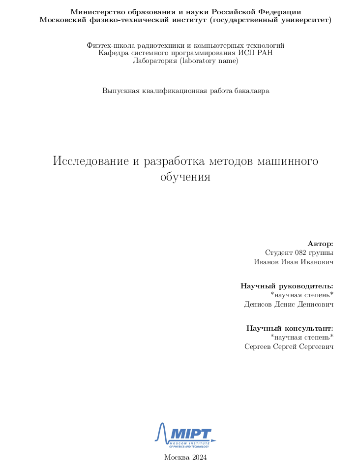

# ВКР МФТИ — Скрытые петли обратной связи в рекомендательных системах

LaTeX-исходник выпускной квалификационной работы.



## О чём работа

Исследуются скрытые петли обратной связи (hidden feedback loops) в рекомендательных системах: рекомендатель обучается на собственных логах кликов, что систематически смещает наблюдаемые предпочтения относительно истинных. Сформулированы и доказаны утверждения о коллапсе пользовательской ковариации, проведена серия численных экспериментов на синтетических данных и MovieLens-20M.

Все экспериментальные данные, графики и численные результаты находятся в `../code/` и `../data/`. Код экспериментов сохраняет PDF-графики напрямую в [figures/](figures/) этой папки.

## Структура исходников

```
paper/
├── main.tex              ─ корневой документ (\input всех частей)
├── parts/                ─ тело работы (главы 0–6 + Annotation, Appendix)
├── include/              ─ титул, work-title, преамбула
├── references.bib        ─ список литературы
├── gost71u.bst           ─ ГОСТ-стиль для BibTeX
├── Makefile, configure.sh, latexrun/   ─ сборка
├── figures/              ─ PDF-графики из экспериментов (H1…T7, DIAG/, legacy/)
├── assets/               ─ логотипы (МФТИ, ФРКТ), картинки для README
├── rules/                ─ нормативные требования и стилевые гайды
│   ├── requirements.md   ─ Положение о ВКР МФТИ (выжимка)
│   ├── rules_langley_icml.md
│   ├── rules_machinelearning_ru.md
│   └── rules_my_first_paper_course.md
├── _refs/                ─ внешние референсные PDF (примеры чужих ВКР)
└── CLAUDE.md             ─ инструкции для AI-агента, работающего над текстом
```

## Сборка

Требуется `texlive` (full): `texlive-latex-base`, `texlive-fonts-recommended`, `texlive-fonts-extra`, `texlive-latex-extra`.

Один раз — инициализация `latexrun` (если ещё не сделан):
```bash
git submodule init && git submodule update
```

Сборка:
```bash
make
```
Результат — `main.pdf`. Промежуточные файлы (`*.aux`, `*.log`, `*.toc`, `*.bbl`, `*.blg`, `*.out`) перечислены в `.gitignore` и игнорируются.

Очистка:
```bash
make clean
```

## Связь с экспериментами

Каждый рисунок в работе ссылается на конкретный эксперимент в `../code/experiments/`:
- `figures/H1_*..H6_*.pdf`, `T1..T7_*.pdf` — основные эксперименты (`[m2p]*.ipynb`).
- `figures/diagnostic/DIAG_*.pdf` — пост-хок диагностика причин коллапса (см. `code/experiments/diagnostic/REPORT.md`).
- `figures/legacy/` — устаревшие версии графиков, оставлены для прослеживаемости.

Сводный отчёт об экспериментах: [../experiment_report.md](../experiment_report.md).

## Шаблон

Структурная основа документа — публичный LaTeX-шаблон [pavel-collab/Bachelor-Thesis-Template](https://github.com/pavel-collab/Bachelor-Thesis-Template), модифицированный под требования кафедры Интеллектуальных систем МФТИ. Шаблонные части (preamble, title-page, gost71u.bst, latexrun) сохранены без изменений.
